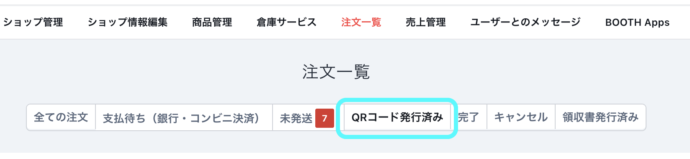

# BOOTH QRコード発行済みタブ

BOOTHのショップ管理画面の注文一覧に「QRコード発行済み」タブを追加し、発送コード（QRコード）発行済みの注文のみを表示するブラウザ拡張機能（Chrome / Firefox 対応、Manifest V3）です。

## 主な機能

- **「QRコード発行済み」タブの追加**
  既存の「未発送」タブの右隣に、動的に「QRコード発行済み」タブを挿入します。
- **発送コード発行済み注文の自動抽出**
  「支払い済み」かつ「発送完了を通知」ボタンがあり、かつ「発送コードを発行する」ボタンがない注文（＝QRコードを発行したがまだ発送通知をしていない注文）のみを表示します。
- **ブラウザの「戻る」ボタンへの対応**
  URLハッシュ（`#qr-issued`）を利用した状態管理を行っているため、ブラウザの「戻る」ボタンを押すだけで、フィルタ解除された「未発送（全表示）」の状態や、遷移前のページへシームレスに戻ることができます。
- **他一括処理拡張機能との共存**
  「BOOTH匿名配送パックQR一括プリント」等の他の一括印刷ツールと競合しません。フィルタで非表示にしている注文は大枠コンテナごとクラス名（`manage-list-table`）を一時退避させるため、他拡張機能の一括印刷を実行した際にも非表示の注文が誤って印刷対象に入らないように設計されています。
- **安全・プライバシーに配慮した設計**
  個人情報や注文情報などの外部通信およびデータの保存は一切行いません。すべての処理はブラウザのローカル環境のみで動作します。

## インストール・開発用読み込み手順

ビルドが不要なプレーンな JavaScript と CSS で構成されているため、ダウンロード後すぐにブラウザにロードして動作確認が可能です。

### Chrome / Brave / Edge の場合
1. ブラウザで `chrome://extensions/`（拡張機能管理画面）を開きます。
2. 右上の「デベロッパー モード」を有効にします。
3. 「パッケージ化されていない拡張機能を読み込む」をクリックし、本リポジトリのルートフォルダ（`booth-qr-filter`）を選択します。

### Firefox / Zen の場合
1. ブラウザで `about:debugging#/runtime/this-firefox` を開きます。
2. 「一時的なアドオンを読み込む...」をクリックし、リポジトリ内の `manifest.json` を選択します。

## ライセンス・プライバシーポリシー
- ライセンスは [MIT License](LICENSE) です。
- 詳細は [docs/privacy_policy.md](docs/privacy_policy.md) をご確認ください。
